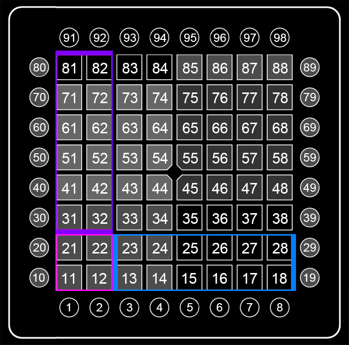

# 方块移动

方块移动可以朝两种方向的，也就是垂直移动(紫色)和水平移动(蓝色)。

通过观察可以得出，垂直移动整个过程都是有规律的(位置+4)，那么我们就可以先塑造一个方块(基类)，通过依次+4来完成垂直移动；而水平移动，可以看到经过红色线时的移动是非常规变化(但也是有规律的，可以通过条件判断来修正)，我们可以以一小格(如36)单块进行变化得出。

# 垂直移动：

构造方块：

**快速生成》**

- 时间：0(从第0帧开始)，
- 范围：11 12 21 22(如图)，
- 间隔：0(间隔为0，那么范围内的格子会同时亮起)，
- 持续：12(根据BPM，在96 BPM下，持续时间等于12/96[八分之一秒])，
- 颜色：5(制作框架的时候通常选择最基础鲜艳的颜色，也便于观察)，
- 类型：上(暂时用不上其他的)。

按下“添加”或“选中”。

那么我们就做好了方块，此时步骤栏会多出Step 1(步骤1)。

依次移动：

1. 选中方块步骤，
2. 选中编辑》
   1. 时间：+12，位置：+10。
   2. 按下“添加”按钮。

此时方块就在第二帧时向上移动了一个，且选中了步骤2。

接着再连续按5次“确定”，就会依次向上移动到顶端。

如此一来垂直移动的(伪)框架就搭建完成了。

# 水平移动：

前面的步骤和上面一样，直到依次移动。

水平的移动为每次向右移动一格，即位置+1：

1. 选中方块步骤，
2. 选中编辑》
   1. 时间：+12，位置：+1。
   2. 按下“添加”按钮。

按下“添加”按钮。

此时方块就在第二帧时向右移动了一个，且选中了步骤2。

接着再连续按5次“确定”，就会依次向右移动到最右端。

如此一来水平移动的(伪)框架就搭建完成了。